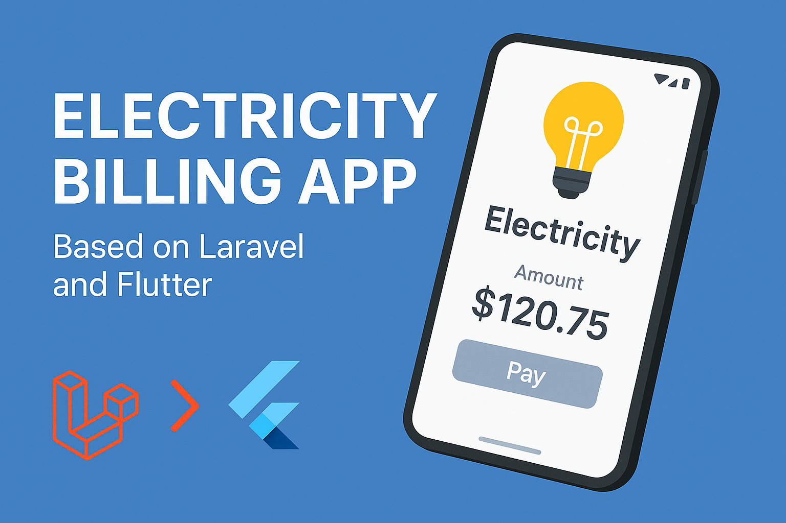
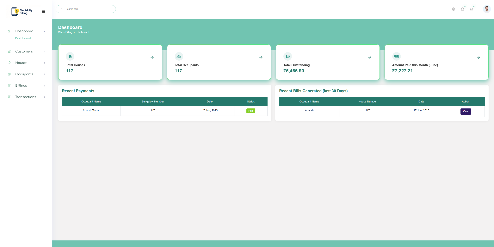

# ⚡ Electricity Billing Application
  

A full-stack Electricity Billing Application built using **Flutter** for the frontend and **Laravel** for the backend.

## 📂 Project Structure

billing-backend (Laravel Backend with Blade Templates)
billing-app-flutter (Flutter Mobile Application)
---

## 🖼️ Screenshots

Here are some previews of the app:

  


---

## 🚀 Getting Started

### 1. Clone the Repository

```bash
git clone https://github.com/your-username/electricity-billing-app.git
cd electricity-billing-app


cd billing-backend

# Install dependencies
composer install

# Copy the example env file
cp .env.example .env

# Generate application key
php artisan key:generate

# Set up your database credentials in .env
# Run migrations
php artisan migrate

# (Optional) Seed initial data
php artisan db:seed

# Start Laravel development server
php artisan serve

cd billing-app-flutter

# Get all dependencies
flutter pub get

# Run the app on connected device
flutter run


DB_CONNECTION=mysql
DB_HOST=127.0.0.1
DB_PORT=3306
DB_DATABASE=billing_db
DB_USERNAME=root
DB_PASSWORD=your_password

APP_URL=http://127.0.0.1:8000


