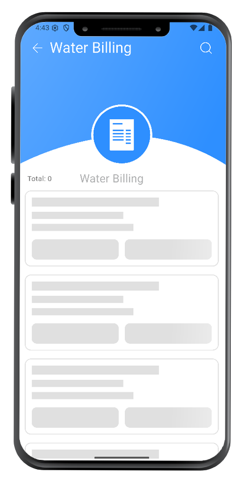
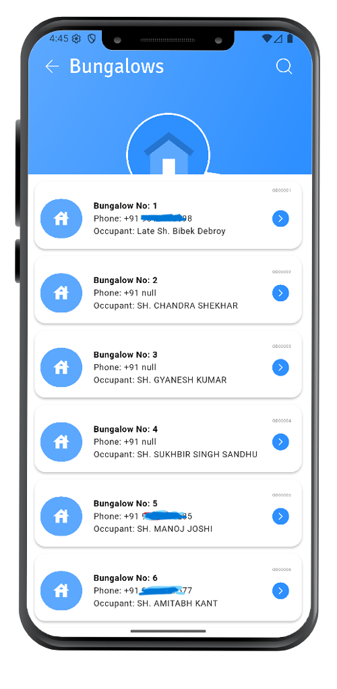
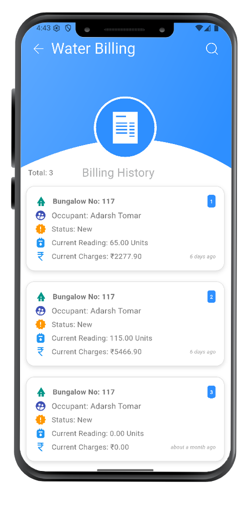

# ⚡ Electricity Billing Application
  

A full-stack Electricity Billing Application built using **Flutter** for the frontend and **Laravel** for the backend.

## 📂 Project Structure

billing-backend (Laravel Backend with Blade Templates) <br>
billing-app-flutter (Flutter Mobile Application)
---

## 🖼️ Screenshots

Here are some previews of the app:

<b>Dashboard</b> :- 
  

  <b>Mobile App Dynamic Configuration</b> :- 
  

<b>Occupant & Houses Tables</b> :- 
  

<b>Unit Slabs</b> :- 


<b>Billing Details</b> :- 


<b>Billing Detail Generation</b> :- 


<b>Generated Bill Email Message</b> :- 


<b>Razorpay Payment Gateway</b> :- 


<b>Payment Success</b> :- 


📱✨ Now the assigned person takes the reading using the mobile app! 🔋📊
✅ No paperwork
📷 Snap the meter
📤 Instantly upload
⚡ Fast, easy & accurate!
## 📲 App Screenshots

### 🔐 App Login Screen  


---

### 📊 Dashboard - Light Mode  


---

### 🌙 Dashboard - Dark Mode  


---

### 💧 Billing Submission *(Dynamic Water Billing)*  


---

### ✨ Shimmer Effect While Loading  


---

### 🏠 Bungalow / Houses List  


---

### 🏡 Bungalow / House Details  


---

### 📜 Billing History  


---

### ❓ FAQ  


---

### 🆘 Help  


---

### 🔒 Privacy Policy  


---


## 🚀 Getting Started

### 1. Clone the Repository

```bash
git clone https://github.com/your-username/billing_application.git

cd billing-backend

# Install dependencies
composer install

# Copy the example env file
cp .env.example .env

# Generate application key
php artisan key:generate

# Set up your database credentials in .env
# Run migrations
php artisan migrate

# (Optional) Seed initial data
php artisan db:seed

# Start Laravel development server
php artisan serve

cd billing-app-flutter

# Get all dependencies
flutter pub get

# Run the app on connected device
flutter run


DB_CONNECTION=mysql
DB_HOST=127.0.0.1
DB_PORT=3306
DB_DATABASE=billing_db
DB_USERNAME=root
DB_PASSWORD=your_password

APP_URL=http://127.0.0.1:8000


